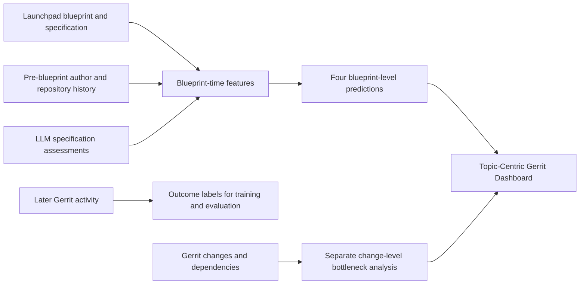

<div align="center">

# Intelligent Topic Analytics for Gerrit Code Review

**Blueprint-level outcome prediction and change-level bottleneck analysis for OpenStack development**

[Repository](https://github.com/zied42/stage_2026) · [Gerrit: OpenDev](https://review.opendev.org/) · [Launchpad](https://launchpad.net/)

</div>

---

## Overview

Features in large software projects often require related code changes across multiple repositories. This project extends a Topic-Centric Gerrit Dashboard with analytics that connect Launchpad planning information to later Gerrit development activity.

The study has **four early prediction tasks at the blueprint level** and **one separate bottleneck task at the Gerrit change level**. Blueprint predictions use information available before a Gerrit topic is created. Later Gerrit records provide the outcome labels. The bottleneck task examines change dependencies and review activity after the changes exist.

## Study Tasks

| Analysis unit | Task | Target |
| --- | --- | --- |
| Launchpad blueprint | Completion time | Identify blueprints with unusually long completion times. |
| Launchpad blueprint | At-risk outcome | Identify blueprints that do not reach a merged outcome. |
| Launchpad blueprint | Excessive rework | Identify unusually high CI retry activity or revision counts. |
| Launchpad blueprint | Review effort | Identify unusually high discussion activity per revision. |
| Gerrit change | Coordination bottleneck | Identify changes with high dependency importance and review delay or open duration. |

The blueprint dataset contains **1,548 completed blueprints**. Blueprint-level inputs combine Launchpad fields, historical author and repository information, specification features, and LLM-derived specification assessments. Later Gerrit activity is used to define outcomes, not as input to the early predictions.



## Reported Results

The best reported ROC-AUC for each blueprint-level task was:

| Blueprint task | Best model | ROC-AUC |
| --- | --- | ---: |
| Long completion time | Random Forest | 0.773 |
| Failure to reach a merged outcome | XGBoost | 0.731 |
| Excessive CI retries or revisions | Random Forest | 0.868 |
| High discussion per revision | Logistic Regression | 0.731 |

For change-level bottleneck analysis, Gradient Boosting reached a ROC-AUC of **0.832** and a PR-AUC of **0.202**. Positive cases made up about 4% of that dataset, so results should be interpreted with the class imbalance in mind. LLM-derived features helped some blueprint tasks and not others; their effect was not uniform.

## Repository Contents

| Path | Purpose |
| --- | --- |
| `hardness_final_v4(1)(2).ipynb` | Blueprint feature analysis, target construction, and model comparison. |
| `build_groupA_dataset.py` | Joins Launchpad blueprint data with related Gerrit topic activity. |
| `llm_hardness_scoring.py` | Produces semantic assessments of blueprint specifications using an OpenAI-compatible NVIDIA NIM endpoint. |
| `collect_changes.py` | Collects Gerrit change records from OpenDev. |
| `build_topic_dataset.py` | Aggregates collected changes into topic-level features. |
| `extract_advanced_features.py` | Builds relation-chain, bottleneck, and early-window topic features. |
| `dependencie/` | Change-dependency analysis and related data-preparation scripts. |
| `topic-centric-gerrit-dashboard-main/` | Dashboard frontend, backend, and prediction service. |

## Getting Started

### Requirements

- Python 3.10 or newer
- Network access to OpenDev Gerrit for data collection
- A NVIDIA NIM API key only when running LLM-based specification scoring

Create an environment and install the root data-pipeline dependencies:

```bash
python -m venv .venv
```

```powershell
# Windows PowerShell
.venv\Scripts\Activate.ps1
```

```bash
# Linux or macOS
source .venv/bin/activate
```

```bash
python -m pip install -r requirements.txt
```

### Collect and Aggregate Gerrit Topic Data

Collect changes for the projects and time range you need. The command can be resumed by running it again with the same query.

```bash
python collect_changes.py --project openstack/nova --since 2023-01-01
python build_topic_dataset.py
```

Build dependency and early-window datasets when needed:

```bash
python extract_advanced_features.py fetch-relations
python extract_advanced_features.py build-bottleneck-features
python extract_advanced_features.py build-snapshot-features --cutoff-hours 48
```

The Gerrit collection commands above create supporting topic-level datasets. The blueprint model notebook uses the prepared blueprint-level CSV inputs described below; collecting Gerrit data alone does not recreate those inputs.

### Run Blueprint-Level Experiments

Open `hardness_final_v4(1)(2).ipynb` in Jupyter after placing the prepared data files in the repository root. The notebook expects these inputs:

- `hardness_dataset_updated.csv`
- `hardness_blueprint_history_features.csv`
- `hardness_spec_derived_features.csv`
- `hardness_llm_scores2.csv` (for LLM feature comparisons)

These datasets are not committed to the repository. They must be prepared from the project's collected and derived data.

### Run LLM Specification Scoring

Set your API key in the environment; do not put credentials in source files:

```powershell
$env:NVIDIA_API_KEY = "your-key"
```

Then run the scorer with a prepared JSONL input:

```bash
python llm_hardness_scoring.py --input hardness_inputs.jsonl --output hardness_llm_scores_with_gpt.csv
```

The scorer supports resuming interrupted work. Review the generated file and align its name and columns with the notebook input before running the model comparison.

## Data and Generated Files

Raw Gerrit responses, prepared datasets, and trained model artifacts are generated locally and are not included in this repository. Some scripts require prepared input files such as `group_a_union.json` or `hardness_inputs.jsonl`. Keep API keys and any sensitive local data out of commits.

## Dashboard

The dashboard sources are under `topic-centric-gerrit-dashboard-main/`. They include a web interface for blueprint predictions, dependency graphs, and LLM-assisted explanations, plus a backend and Python prediction service. The prediction service's Python dependencies are listed in `topic-centric-gerrit-dashboard-main/backend/prediction_service/requirements.txt`.

## Authors

**Zied Daif** and **Mohamed Hechem Ghorbel**
Internship supervisors: **Dr. Marouen Chaieb** and **Dr. Moataz Chouchen**
