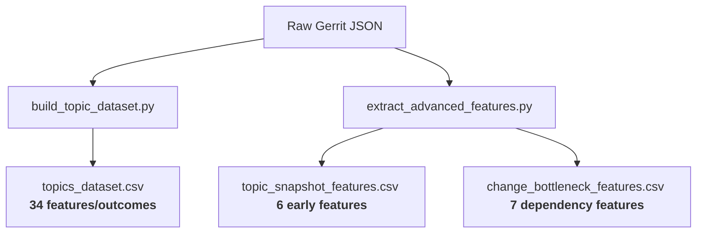

# OpenStack Gerrit Topic Analytics & Prediction Pipeline

This repository contains the complete data-mining and feature-engineering pipeline for modern code review workflows on [review.opendev.org](https://review.opendev.org). 

It is designed to collect raw Gerrit changes, group them by topics, construct temporal and relationship graphs (relation chains), and build advanced feature sets mapping to the 5 key prediction tasks of the **Intelligent Gerrit Topic Analytics** internship project.

---

## 🚀 Quick Start & Workflow

### 1. Installation
Activate your virtual environment and install the required dependencies:
```bash
# Activate virtual environment (Windows example)
venv\Scripts\activate

# Install dependencies (requests, pyarrow, etc.)
pip install -r requirements.txt
```

### 2. Verify with Small-Sample Test Pipeline
To run a complete end-to-end dry-run of the pipeline (data sampling, aggregation, early-window extraction, bottleneck construction, and 60 feature verification checks):
```bash
python test_pipeline_small.py
```
*This will output a final report confirming if all checks and feature coverages are successful.*

### 3. Run the Production Pipeline on Full Data
To mine the full datasets for analysis and prediction tasks:

```bash
# Step A: Collect raw change data from Gerrit APIs
python collect_changes.py --project openstack/nova --project openstack/neutron --since 2023-01-01

# Step B: Build core topic-level features (Tasks #1, #2, #4)
python build_topic_dataset.py

# Step C: Fetch relation chains for bottleneck analysis (Task #3)
# Note: This makes 1 API call per change. It is resumeable.
python extract_advanced_features.py fetch-relations

# Step D: Compute change bottleneck features
python extract_advanced_features.py build-bottleneck-features

# Step E: Compute early-window snapshot features (Task #5)
python extract_advanced_features.py build-snapshot-features --cutoff-hours 48
```

---

## 📦 Datasets Built & Feature Count

The pipeline outputs **three distinct datasets** targeting specific prediction scopes:



### 1. Core Topic-Level Dataset (`topics_dataset.csv`)
* **Level:** Topic
* **Columns:** **35 total** (1 identifier `topic_id`, and **34 features & outcomes** representing full-lifetime metrics).
* **Target Tasks:** #1 (Review Delays), #2 (Stall Risk), #4 (CI Reruns).

### 2. Early-Window Snapshot Dataset (`topic_snapshot_features.csv`)
* **Level:** Topic
* **Columns:** **8 total** (1 identifier `topic_id`, 1 parameter `cutoff_hours`, and **6 early-window features** computed within 48h of topic start).
* **Target Tasks:** #5 (Early prediction of high review effort).
* **Leakage-Safe Training:** Join this snapshot file with the final outcomes from the core dataset (`topics_dataset.csv` via `topic_id`).

### 3. Change Bottleneck Dataset (`change_bottleneck_features.csv`)
* **Level:** Change (individual patchsets)
* **Columns:** **11 total** (4 metadata/identifiers, and **7 bottleneck/relation-chain features**).
* **Target Tasks:** #3 (Coordination bottleneck detection).


---

## 💡 Why These Datasets are Useful & How to Use Them

These datasets are specifically engineered to train machine learning models and perform analytics for the five internship tasks:

### 1. Leakage-Safe Predictive Modeling (Task #5 & Early Warnings)
* **The Problem:** If you try to predict *"Will this review topic stall?"* using features from its entire lifetime, your model will cheat (label leakage) because it sees future data (like total comments, total patch revisions) that accumulated *after* the prediction point.
* **The Solution:** Use the features in `topic_snapshot_features.csv` (everything known strictly up to the 48-hour cutoff) as your model's **Input Features ($X$)**, and the final `outcome` and metrics from `topics_dataset.csv` as your **Target Labels ($y$)**. This ensures you can predict risks early on live dashboards.

### 2. Uncovering Git/Gerrit Dependency Stacks (Task #3)
* **The Problem:** Changes in Gerrit are often stacked sequentially (stacked reviews). If a root change is delayed, all changes stacked on top of it are blocked. Standard Gerrit lists do not calculate these relationships.
* **The Solution:** The `change_bottleneck_features.csv` dataset maps out this graph. Using metrics like `num_blocked_children` and `in_degree_in_chain`, models can immediately highlight root bottlenecks blocking multiple dependent developer streams.

### 3. Disentangling Human Actions from Bot Noise (Task #1 & #4)
* **The Problem:** In active repositories, automated CI bots (e.g., Zuul) write thousands of comments and run thousands of builds. Mixing bot and human comments ruins metrics like "reviewer feedback delays."
* **The Solution:** The pipeline automatically parses bot IDs and separates metrics. Bot feedback is isolated into CI feature columns (`ci_runs`, `ci_failures`, `ci_retries`), while human responses are parsed into pure review delay metrics (`first_review_delay_hours`).

---

## 📋 Comprehensive Feature Directory

### Core Topic Dataset (`topics_dataset.csv` - 34 Features/Outcomes)
* **Metadata & Identifiers:**
  * `topic_id`: The topic string identifier.
  * `n_changes`: Total number of changes associated with this topic.
  * `n_repos`: Number of distinct repository projects involved.
  * `n_branches`: Number of distinct target Git branches involved.
  * `total_revisions`: Total revisions across all changes.
  * `total_messages`: Total review messages posted.
  * `n_reviewers`: Total unique reviewers who commented or voted.
  * `created_at`, `last_updated_at`: First and last active timestamps.
  * `time_to_completion_hours`: Net elapsed hours from creation to merge of all changes (null if not fully merged).
* **Task #1: Long Review Delays:**
  * `first_review_delay_hours`: Time to first human (non-bot) comment.
  * `avg_review_delay_hours`: Average delay between human comment responses.
  * `avg_active_days`: Average lifespan of changes in the topic.
* **Task #2: Stall & Abandon Risk:**
  * `outcome`: Category of the topic (`merged`, `abandoned`, `stale_open`, `mixed`).
  * `last_activity_gap_days`: Days since last update (useful to capture stalling).
  * `n_merged`, `n_abandoned`, `n_open`: Distribution of change statuses.
* **Task #4: CI Churn & Patch Revisions:**
  * `ci_runs`: Total CI runs across all changes in the topic.
  * `ci_successes`, `ci_failures`: Success and failure votes cast by CI bots.
  * `ci_failure_rate`: Ratio of failed runs to total runs.
  * `ci_retries`: Total human `recheck` messages plus auto-triggered rerun drops.
  * `total_patchsets`: Total number of revisions uploaded.
  * `avg_patchsets_per_change`: Revisions per change.
  * `max_files_changed`: Largest file count touched in any single patchset.
* **Review & Collaborators:**
  * `total_code_review_plus2`, `total_code_review_minus2`: Frequency of critical review votes.
  * `people_involved_count` / `author_count`: Unique human contributors (commenters, owners, uploaders).
  * `code_authors_count`: Unique strict authors (owners + uploaders only).
  * `authors_per_change`: Average number of unique contributors per change.
  * `top_author_changes`: Maximum changes authored by a single contributor.

### Topic Snapshot Dataset (`topic_snapshot_features.csv` - 6 Features)
* **Early-Window Aggregates (calculated strictly up to the `--cutoff-hours` timestamp):**
  * `initial_change_count`: Changes linked to the topic at cutoff.
  * `early_comment_count`: Total comments posted.
  * `early_comment_velocity`: Comments per hour.
  * `early_unique_reviewers`: Distinct human reviewers active.
  * `early_patchset_count`: Total revisions uploaded early.
  * `early_human_comment_ratio`: Ratio of human-to-bot feedback.

### Change Bottleneck Dataset (`change_bottleneck_features.csv` - 7 Features)
* **Dependency & Relation Chain Metrics:**
  * `chain_length`: Size of the Gerrit relation chain/stack.
  * `is_chain_root`: Boolean indicating if this change is the root dependency.
  * `in_degree_in_chain`: Number of changes stacked on top of this change.
  * `num_blocked_children`: Number of stacked open/non-merged dependent changes.
  * `submittable`: Gerrit's submittable state indicator.
  * `code_review_plus2`, `code_review_minus2`: Indicator of existing +2 approvals or -2 blocks on the change.

---

## 🛠️ Configuration & Extension
* **Add Projects / Modify Dates:** Update settings in `collect_changes.py` or pass them as CLI options:
  ```bash
  python collect_changes.py --project openstack/cinder --since 2024-01-01
  ```
* **Bot Filtering:** Custom bot and CI detection prefixes can be adjusted in `build_topic_dataset.py` via `CI_TAG_PREFIXES` and `BOT_USERNAME_HINTS`.
